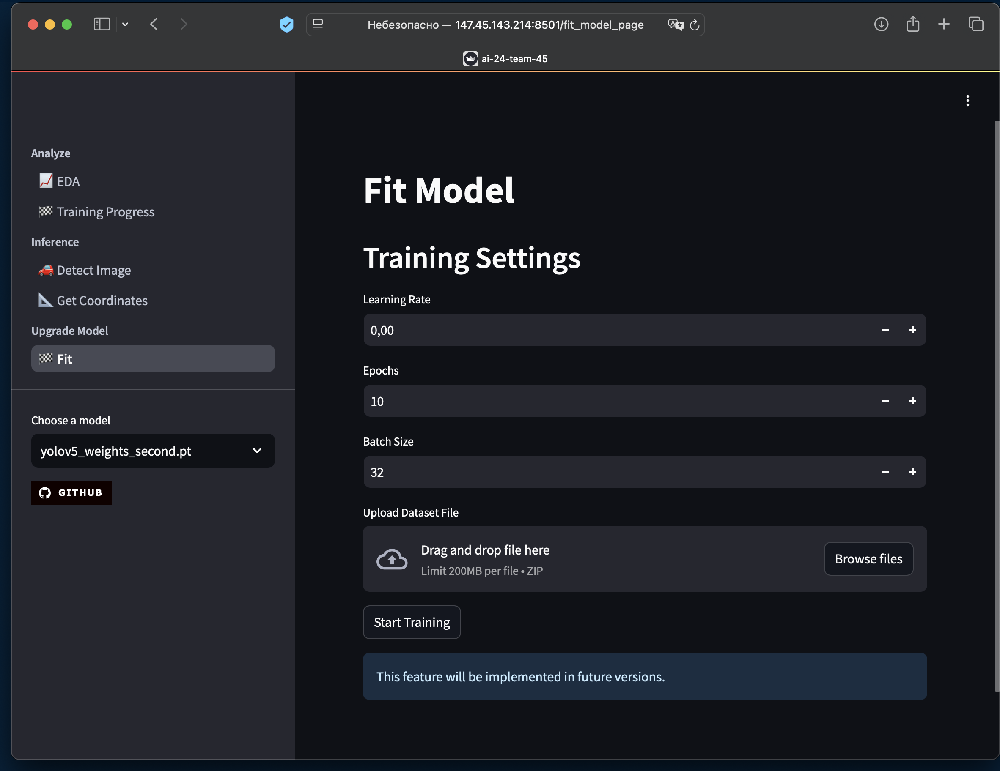

# AI-24-Team-45

**MVP приложения для детекции транспортных средств методами глубинного обучения.**

**В основе решения используется модель YOLOv5, обученная на датасете из 83 791 изображений за 28 эпох.**<br/>

> [!NOTE]
> MVP приложения размещено на сервере и доступно по ссылке:
>
> http://147.45.143.214:8501

<br/>

## Текущий функционал

### Inference

#### **_Определение транспортных средств и их классификация на картинке_**


С помощью этого функционала пользователь может загрузить изображение и получить результаты детекции транспортных средств.
На изображении будут выделены рамки вокруг объектов, а также определены их классы:

- bicycle
- motorcycle
- car
- transporter (van)
- bus
- truck (others)
- trailer - no instance of it in the dataset
- unknown
- mask

<br/>

#### **_Определение транспортных средств и их классификация в координатах_**


С помощью этого функционала пользователь может получить результаты детекции в виде координат классифицированных объектов.

> [!TIP]
> Пользователю предоставляется возможность выбрать 1 из немкольких моделей загруженных на сервер

<br/><br/>

### Analyze

#### **_EDA и демонстрация метрик обучения_**


С помощью этого функционала пользователь может изучить графики и статистические метрики, полученные на этапе обучения модели (28 эпох).
Функция полезна для анализа качества модели, выявления возможных улучшений и понимания структуры данных.
<br/><br/>

### Fit

#### **_Дообучение модели на пользовательском датасете_**



В рамках MVP данный функционал пока недоступен. Однако в будущем планируется предоставить пользователю возможность дообучения модели, загружая собственные датасеты.
Кроме того, планируется реализация отображения прогресса обучения и изменений метрик в реальном времени.
<br/>

> [!NOTE]
> На текущем этапе модель показывает базовые результаты, но обладает большим потенциалом для улучшений при дополнительной настройке и дообучении.

## Участники

### Куратор

```
Козлов Кирилл @dedpe
```

### Разработчики

```
Зверев Дмитрий Сергеевич @dimaszverev
Кривошеина Ирина Владимировна @irina_peterhof
```

## Описание датасета:

[**UA-DETRAC Dataset**](https://www.kaggle.com/datasets/dimarmalade/ua-detrac-reannotated-classes)  
Более подробная информация доступна в [документации](https://www.albany.edu/faculty/mchang2/files/2020_01_CVIU_DETRAC.pdf).

**_Алгоритм детекции: YOLOv5_**
